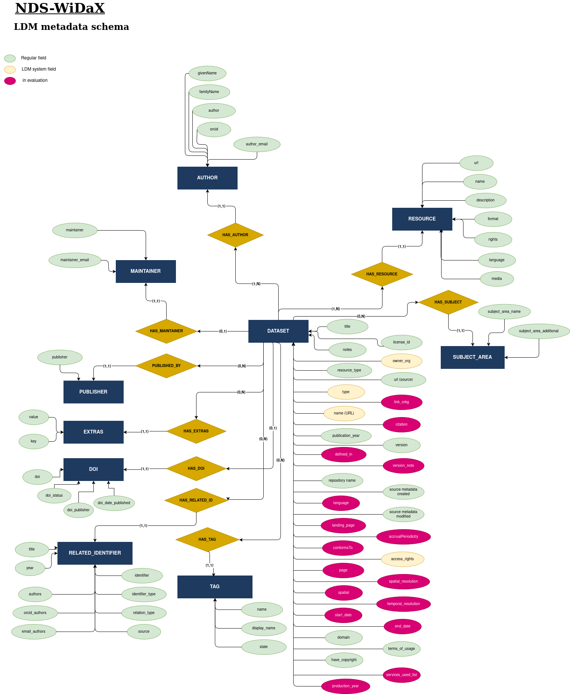

# Importation process

## Leibniz Data Manager (LDM)

Nds-WiDaX builds on the Leibniz Data Manager ([LDM](https://github.com/SDM-TIB/LDM_Docker/)) – an open, semantics-oriented software service – to enable machine-readable, contextually rich indexing of heterogeneous (meta)data from research data repositories across Lower Saxony.

## Metadata importation process

LDM's Nds-WiDaX instance collects datasets' metadata from Lower Saxony repositories using APIs (more details in **[documentation](../Plugin-Python/documentation/LowerSaxonyRepositoriesDocumentation.md#2.-repository-profiles-and-technical-specifications)**) and performs the importation following these steps:

1. JSON files for each dataset are converted from the source schema into a new file respecting the LDM's metadata schema, allowing a clean importation. This transformation is performed using a declarative mapping language developed by the TIB-SDM group (**[LDM-ML](https://github.com/SDM-TIB/FAIR_RDM_APIs/tree/main/knowledge_graph_managment/knowledge_graph_integration/api)**).
An "Input Mapping file" is created for each repository and used to convert each "Source data" (one per Dataset in the source) into an "Output file" respecting the WiDaX metadata schema.

2. The Dataset is inserted in the WiDaX-LDM instance using the "Output file" containing all the metadata of the Dataset in WiDaX metadata schema.

### Input mapping example

Descriptive fragment of mapping metadata from the source (e.g. GRO.data repository) schema to target (i.e., Nds-WiDaX) schema:

```json
{
    "source": "https://data.goettingen-research-online.de/api/search?q=*&type=dataset&per_page=500",
    "owner": "goettingen",
    "iterator": "$",
    "properties": [
        {
            "source_property": "license",
            "ldm_property": "license_id"
        },
        {
            "source_property": "license_title",
            "ldm_property": "license_title"
        },
        {
            "source_property": "description",
            "ldm_property": "notes"
        },
        {
            "source_property": "@type",
            "ldm_property": "resource_type"
        },
        {
            "source_property": "identifier",
            "ldm_property": "repository_name",
            "transformation_function": {
                "function": "setConstant",
                "parameters": {
                    "value": "Göttingen Research Online Data"
                }
            }
        }
    ] 
}
```

### Source Data example

Descriptive fragment of a dateset from the GRO.data (Göttingen) repository retrieved via its API:

```json
  {
    "@context": "http://schema.org",
    "@type": "Dataset",
    "@id": "https://doi.org/10.25625/01QSDQ",
    "identifier": "https://doi.org/10.25625/01QSDQ",
    "name": "Replication Data for: Central bank announcements news and short portfolio risks",
    "description": "This repository contains the data, code, and results associated with our paper \u201eCentral bank announcements news and short portfolio risks\u201c.",
    "license": "http://creativecommons.org/publicdomain/zero/1.0",
    "license_title": "Creative Commons Zero (CC0)",
}
```

### Output file example

Applying the above metadata mapping from source to target (Nds-WiDaX) schema provides the follwing snippet:

```json
  {

    "license_id": "http://creativecommons.org/publicdomain/zero/1.0",
    "license_title": "Creative Commons Zero (CC0)",
    "notes": "This repository contains the data, code, and results associated with our paper \u201eCentral bank announcements news and short portfolio risks\u201c.",
    "resource_type": "Dataset",
    "repository_name": "G\u00f6ttingen Research Online Data",
}
```

Also, the mapping language (LDM-ML) allows the possibility of running functions over the source metadata for more complex transformations. In this example, the function "setConstant" is used over the field "repository_name" in the "Input Mapping".

```python
[
    def setConstant(value: str, params: Dict) -> str:
        return params.get("value", "")
]
```

## Nds-WiDaX metadata schema

Overview of the Nds-WiDaX-specific metadata schema, based on the template from [LDM](#leibniz-data-manager-ldm):




## 🗂️ Folder Structure

| Folder | Description |
|--------|-------------|
| `json_importation_files/<repository name>/json_files_from_source` | Source and transformed JSON metadata files per repository coming directly from the REST APIs or converted to JSON in case of OAI-PMH APIs (XML format) |
| `json_importation_files/<repository name>/json_files_mapped_to_LDM` | Transformed JSON metadata files per repository adapted to the LDM-WiDaX metadata schema |
| `json_mappings/` | Mapping files using the declarative mapping language for each repository |
