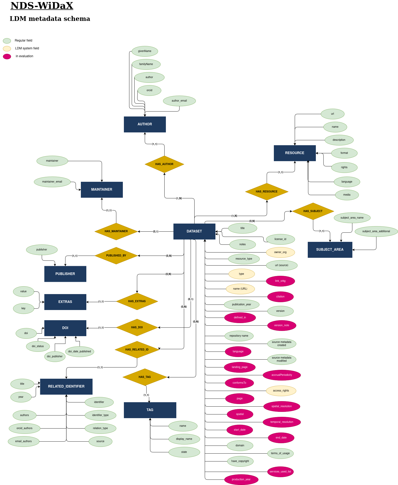
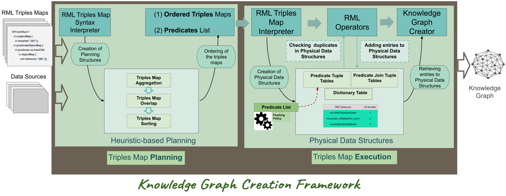

## Leibniz Data Manager (LDM)

Nds-WiDaX builds on the Leibniz Data Manager (**[LDM](https://github.com/SDM-TIB/LDM_Docker/)**) – an open, semantics-oriented software service – to enable machine-readable, contextually rich indexing of heterogeneous (meta)data from research data repositories across Lower Saxony.

## Importation process

LDM's Nds-WiDaX instance collects datasets' metadata from Lower Saxony repositories using APIs (more details in **[documentation](../Plugin-Python/documentation/LowerSaxonyRepositoriesDocumentation.md#2.-repository-profiles-and-technical-specifications)**) and performs the importation following these steps:

1. JSON files for each dataset are converted from the source schema into a new file respecting the LDM's metadata schema, allowing a clean importation. This transformation is performed using a declarative mapping language developed by the TIB-SDM group (**[LDM-ML](https://github.com/SDM-TIB/FAIR_RDM_APIs/tree/main/knowledge_graph_managment/knowledge_graph_integration/api)**).
An "Input Mapping file" is created for each repository and used to convert each "Source data" (one per Dataset in the source) into an "Output file" respecting the WiDaX metadata schema.

2. The Dataset is inserted in the WiDaX-LDM instance using the "Output file" containing all the metadata of the Dataset in WiDaX metadata schema.

### Example of Input Mapping (descriptive fragment of Goettingen's mapping)
```json
{
    "source": "https://data.goettingen-research-online.de/api/search?q=*&type=dataset&per_page=500",
    "owner": "goettingen",
    "iterator": "$",
    "properties": [
        {
            "source_property": "license",
            "ldm_property": "license_id"
        },
        {
            "source_property": "license_title",
            "ldm_property": "license_title"
        },
        {
            "source_property": "description",
            "ldm_property": "notes"
        },
        {
            "source_property": "@type",
            "ldm_property": "resource_type"
        },
        {
            "source_property": "identifier",
            "ldm_property": "repository_name",
            "transformation_function": {
                "function": "setConstant",
                "parameters": {
                    "value": "Göttingen Research Online Data"
                }
            }
        }
    ] 
}
```
### Example of Source Data (descriptive fragment of a Goettingen's Dataset)
```json
  {
    "@context": "http://schema.org",
    "@type": "Dataset",
    "@id": "https://doi.org/10.25625/01QSDQ",
    "identifier": "https://doi.org/10.25625/01QSDQ",
    "name": "Replication Data for: Central bank announcements news and short portfolio risks",
    "description": "This repository contains the data, code, and results associated with our paper \u201eCentral bank announcements news and short portfolio risks\u201c.",
    "license": "http://creativecommons.org/publicdomain/zero/1.0",
    "license_title": "Creative Commons Zero (CC0)",
}
```
### Example of Output file (respecting WiDaX schema)
```json
  {

    "license_id": "http://creativecommons.org/publicdomain/zero/1.0",
    "license_title": "Creative Commons Zero (CC0)",
    "notes": "This repository contains the data, code, and results associated with our paper \u201eCentral bank announcements news and short portfolio risks\u201c.",
    "resource_type": "Dataset",
    "repository_name": "G\u00f6ttingen Research Online Data",
}
```

Also, the mapping language (LDM-ML) allows the possibility of running functions over the source metadata for more complex transformations. In this example, the function "setConstant" is used over the field "repository_name" in the "Input Mapping".

```python
[
    def setConstant(value: str, params: Dict) -> str:
        return params.get("value", "")
]
```


##




## Knowledge Graph Creation

Once the Dataset is inserted in WiDaX-LDM, the metadata extracted is semantified using the SDM-RDFizer, an interpreter of mapping rules that allows the transformation of (un)structured data into RDF knowledge graphs (**[SDM-RDFizer](https://github.com/SDM-TIB/SDM-RDFizer)**).
The current version of the SDM-RDFizer assumes mapping rules are defined in the RDF Mapping Language (**[RML](https://rml.io/specs/rml/)**) by Dimou et al.



### The Knowledge Graph is going to be a key asset in the project and used to validate metadata, and find, evaluate and fix interoperability issues that could be inserted during the importation process over different sources and different metadata schemas.

# 📁 Mapping files for WiDaX importation

**Folder:** `Mapping_files`

---

## 📦 Contents

In this folder we can find:

- `json_importation_files/Repository Name/json_files_from_source`: JSON files coming directly from repositories' REST APIs or converted to JSON in case of OAI-PMH APIs (XML).
- `json_importation_files/Repository Name/json_files_mapped_to_LDM`: JSON files adapted to the LDM-WiDaX metadata schema.
- `json_mappings`: Mapping files using the declarative mapping language for each repository.
- `RDFizer_mappings`: Mapping files in RML used for metadata semantification.

---

## 🗂️ Folder Structure

| Folder | Description |
|--------|-------------|
| `json_importation_files/` | Source and transformed JSON metadata files per repository |
| `json_mappings/` | Declarative mappings for repository-specific schema conversion |
| `RDFizer_mappings/` | RML mappings for RDF graph semantification |

---
